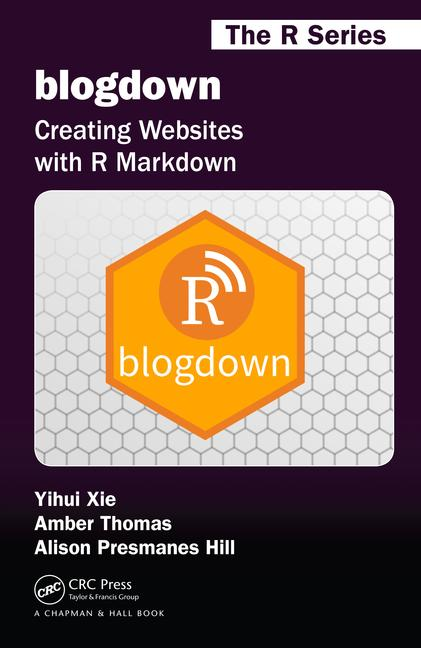

layout: true

<div class="my-footer"></div>  

```{r setup, include = FALSE}
knitr::opts_chunk$set(dpi = 250, fig.height = 5, fig.width = 9, fig.align = 'center', cache = TRUE, eval = FALSE)
```

---

layout: false

class: inverse, center, middle

# INTRODUCTION

<html><div style='float:left'></div><hr color='#EB811B' size=1px width=720px></html> 

---

class: center

# About blogdown...

This presentation is completely based on the **Yihui Xie** book <a href="https://bookdown.org/yihui/blogdown/" target="_blank"><i>"blogdown: Creating Websites with R Markdown"</i></a>, his RStudio <a href="https://slides.yihui.name/2017-rstudio-webinar-blogdown-Yihui-Xie.html" target="_blank">materials</a> and Alison Presmanes <a href="https://alison.rbind.io/slides/blogdown-workshop-slides.html" target="_blank">materials</a>.

.pull-left[



]

.pill-right[

## Authors:

_**Yihui Xie**, Amber Thomas, Alison Presmanes Hill_

_"The three authors have never met each other. Hopefully, you can better see why you should have a website now."_

]

---

class: center

# What's blogdown?

## An R package for creating websites using RMarkdown and Hugo

### <u>RMarkdown:</u> writing documents portable and reproducible with R
### <u>Hugo:</u> Is the static site generator on which blogdown is based. It's free, open-source and general-purpose (not only for blogs)
  

  
---

layout: false

class: inverse, center, middle

# GET STARTED

<html><div style='float:left'></div><hr color='#EB811B' size=1px width=720px></html> 

---

# Installation

## 1. blogdown installation

```{r}
## Install from CRAN
install.packages("blogdown")

## Or, install from GitHub
if (!requireNamespace("devtools")) install.packages("devtools")
devtools::install_github("rstudio/blogdown")
```

## 2. Hugo installation using blogdown

```{r}
blogdown::install_hugo()

## To update Hugo use
# blogdown::update_hugo() 
```

---

# Create your own website

## 1. From the RStudio menu: "File -> New Project -> New Directory"

 

---

# Create your own website

## 2. From console (I always prefer this option)

```{r}
## Create site with default theme 
blogdown::new_site()
```

--

# Themes

You can find a theme in <a href="https://themes.gohugo.io/" target="_blank">https://themes.gohugo.io/</a>

```{r}
# for example, create a new site with the academic theme
blogdown::new_site(theme = "gcushen/hugo-academic")
```

**Always is recomended to create a new RStudio project before type this code!**

---

# Useful advices/comments from Yihui about themes...

  - "You will naturually have strong desire for fancier themes, but I recommend you to try simpler themes in the beginning"

  - "Spend more time on creating the content"

  - "You will be tired of your theme someday, no matter how good it looks for now"

---
class: center

# Congrats! You already have a website!

## Your website directory should look like this ...


---

# View your website

## 1. From console

```{r}
blogdown::serve_site()
```

## 2. From RStudio _Addin_


---

layout: false

class: inverse, center, middle

# EDIT YOUR WEBSITE

<html><div style='float:left'></div><hr color='#EB811B' size=1px width=720px></html> 

---

# Start to customize your website

The `config.toml` is the first file that you should modify. It contains the "main"<sup>1</sup> options/parameters in the theme

.footnote[
[1] depends on what you want for your website...
]

--

  - You can go to the documentation of the theme (often README page of the GitHub repository)
  - **Not all options can be changed**. The options in `config.toml` depends on each theme
  - If you want to modify some parameter in your theme that is not in `config.toml`, don't worry!
    - You can explore and modify files in the `themes/<YOUR THEME>/` and `static/` folders
    
---

# Change your logo

The logo file belongs in the `static/images/` directory -> change current logo for your new logo!

_"`static/` stores all the static content for your future website: images, CSS, JavaScript, etc. When Hugo builds your site, all assets inside your static directory are copied over as-is."_

---

# Edit the CONTENT in your website

_"The folder `content/` stores all content for your website... Each top-level folder in Hugo is considered a content section. For example, if your site has two main sections—blog posts and your about page— you will have 1 directory at `content/post/` and 1 file `content/about.md`"_

--

Here is where **RMarkdown** can play an important role!

  - All this documents/posts could be written in plain markdown or in RMarkdown (to generate plots, write code, etc. in R)

---

layout: false

class: inverse, center, middle

# DEPLOYMENT

<html><div style='float:left'></div><hr color='#EB811B' size=1px width=720px></html> 

---

# There are many options but I will only comment two of them

--

## 1. <a href="https://www.netlify.com/">Netfly</a> (strongly recommended by the authors)

  - Netlify is the new and much more flexible Github Pages 
  - Netlify allows you to quickly publish a website by uploading the `public/` folder through its web interface
  - Good for those websites that are not updated frequently (or at all)

--

## 2. <a href="https://pages.github.com/">Github Pages</a>

  - Could be a nightmare
  - Really helpful <a href="https://gohugo.io/hosting-and-deployment/hosting-on-github/#step-by-step-instructions">tutorial</a> (require some terminal skills)
  - I'm not sure why, but <a href="https://pcastellanoescuder.github.io/">my blogdown page</a> is hosted on Github Pages

---

class: inverse, center, middle

# Thank you all!

<a href="mailto:polcaes@gmail.com">&nbsp; polcaes@gmail.com</a><br>
<a href="https://pcastellanoescuder.github.io/">&nbsp; https://pcastellanoescuder.github.io/</a><br>
<a href="http://twitter.com/polcastellano_">&nbsp; Twitter: @polcastellano_</a><br>
<a href="http://github.com/pcastellanoescuder">&nbsp; Github: @pcastellanoescuder</a>
<br>
<br>
<a href="https://grbio.upc.edu/en">GRBIO Research Group</a>

